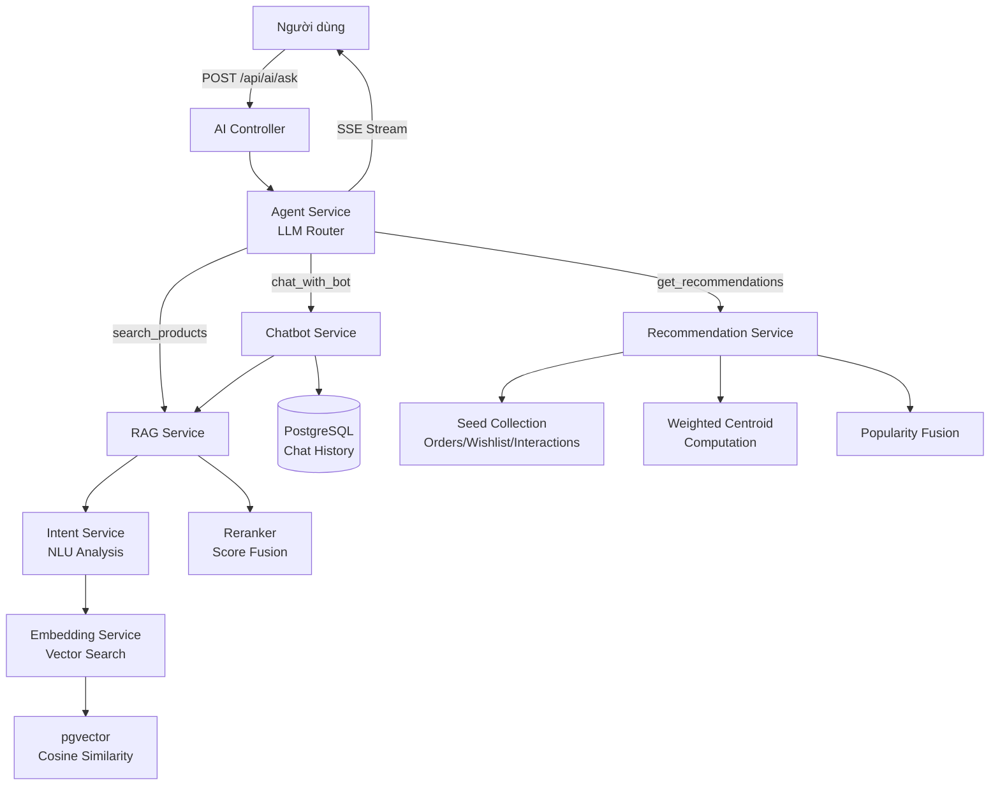

# 📊 Phân Tích & Đánh Giá Dự Án AI Chatbot Service

> **Ngày phân tích:** 11/05/2026  
> **Phiên bản:** Python 3.x + Flask  
> **Mục đích:** Dịch vụ AI chatbot tư vấn sản phẩm thể thao, tích hợp tìm kiếm ngữ nghĩa, gợi ý cá nhân hóa

---

## 📁 Tổng Quan Kiến Trúc

```
ai-chatbot-service/
├── run.py                          # Entry point (Flask server)
├── seed_data.py                    # Script vectorize sản phẩm ban đầu
├── seed_recommendation_data.py     # Script tạo dữ liệu test recommendation
├── test_ask.html                   # Giao diện test chatbot (SSE streaming)
├── requirements.txt                # Dependencies
├── .env                            # Cấu hình (DB, API keys)
└── app/
    ├── __init__.py                 # Flask app factory + CORS + auto-sync
    ├── utils/
    │   └── config.py               # Singleton config từ .env
    ├── controllers/
    │   └── ai_controller.py        # REST API endpoints (4 routes)
    ├── models/                     # (Trống – dùng raw SQL thay ORM)
    └── services/
        ├── agent_service.py        # LLM Orchestrator (Function Calling)
        ├── chatbot_service.py      # RAG Chatbot multi-turn
        ├── rag_service.py          # Hybrid RAG pipeline (Intent → Vector → Rerank)
        ├── intent_service.py       # NLU – phân tích ý định mua hàng
        ├── embedding_service.py    # Vector embedding (Together AI)
        ├── recommendation_service.py # Gợi ý cá nhân hóa (Centroid-based)
        ├── sync_service.py         # Auto-sync vectorize sản phẩm mới
        └── db_service.py           # Database connection pool (Singleton)
```

### Sơ đồ luồng xử lý chính



---

## 🛠️ Công Nghệ Sử Dụng

### 1. Backend Framework

| Công nghệ | Phiên bản | Vai trò |
|---|---|---|
| **Flask** | 3.1.3 | Web framework chính, xử lý HTTP request |
| **Flask-CORS** | — | Cho phép cross-origin requests |
| **SQLAlchemy** | 2.0.49 | ORM/Database toolkit (dùng raw SQL + connection pool) |

### 2. AI/ML Stack

| Công nghệ | Model/Phiên bản | Vai trò |
|---|---|---|
| **Together AI** | API v2.11.0 | Platform chạy LLM inference |
| **Llama 3.3 70B Instruct Turbo** | meta-llama | LLM chính cho routing, intent analysis, sinh câu trả lời |
| **intfloat/multilingual-e5-large-instruct** | 1024 chiều | Embedding model đa ngôn ngữ (hỗ trợ tiếng Việt) |
| **LangChain** | 1.2.15 | Framework orchestration cho chatbot multi-turn |
| **LangChain-OpenAI** | 1.1.14 | Adapter gọi Together AI qua OpenAI-compatible API |

### 3. Database & Vector Store

| Công nghệ | Vai trò |
|---|---|
| **PostgreSQL** | Database chính (sản phẩm, đơn hàng, user, chat history) |
| **pgvector** | Extension PostgreSQL cho vector similarity search |
| **psycopg2-binary** | PostgreSQL driver cho Python |

### 4. Giao tiếp & Streaming

| Công nghệ | Vai trò |
|---|---|
| **Server-Sent Events (SSE)** | Streaming response real-time từ server → client |
| **Fetch API + ReadableStream** | Client-side SSE consumer (test_ask.html) |

### 5. Validation & Utilities

| Công nghệ | Vai trò |
|---|---|
| **Pydantic** | Schema validation cho intent extraction (QueryIntent model) |
| **NumPy** | Tính toán vector centroid trong recommendation |
| **python-dotenv** | Load biến môi trường từ .env |

---

## 🧠 Thuật Toán & Kỹ Thuật AI

### 1. 🔀 LLM-based Intent Routing (Function Calling)

**File:** `agent_service.py`

**Mô tả:** Sử dụng LLM (Llama 3.3 70B) như một **orchestrator** để phân tích câu hỏi người dùng và tự động chọn tool phù hợp.

**Cách hoạt động:**
1. Định nghĩa 3 tools: `search_products`, `chat_with_bot`, `get_recommendations`
2. Gửi prompt hệ thống kèm quy tắc chọn tool cho LLM
3. LLM trả về JSON `{"tool": "...", "arguments": {...}}`
4. Agent thực thi tool tương ứng và stream kết quả

**Đánh giá:**
- ✅ Thiết kế linh hoạt, dễ mở rộng thêm tool mới
- ✅ Temperature = 0.0 giúp output ổn định, deterministic
- ✅ Có xử lý alias key (`product_name` → `query`) phòng LLM sinh sai key
- ⚠️ Dùng prompt-based routing thay vì native function calling của API → có thể sinh JSON không hợp lệ

---

### 2. 🔍 Hybrid RAG Pipeline (Retrieval-Augmented Generation)

**File:** `rag_service.py`

**Mô tả:** Pipeline 3 giai đoạn kết hợp NLU, vector search và reranking.

```
┌─────────────┐    ┌──────────────────┐    ┌─────────────┐
│ Giai đoạn 0  │    │  Giai đoạn 1      │    │ Giai đoạn 2  │
│ Intent NLU   │───▶│  Vector Search    │───▶│  Reranking   │
│ (LLM/Regex)  │    │  (pgvector)       │    │ (Score Fusion│
└─────────────┘    └──────────────────┘    └─────────────┘
```

#### Giai đoạn 0: Intent Analysis (`intent_service.py`)

- **Thuật toán chính:** LLM-based Named Entity Recognition + Slot Filling
- **Schema trích xuất (Pydantic):**
  - `search_keywords`: Từ khóa tích cực
  - `max_budget`: Ngân sách tối đa (VNĐ)
  - `category_id`: Danh mục (1=Giày, 2=Quần áo, 3=Phụ kiện)
  - `brand_name`: Thương hiệu (hỗ trợ slang: "das"→Adidas, "nai"→Nike)
  - `color_preference`: Màu sắc mong muốn
  - `excluded_keywords`: Từ khóa phủ định
  - `sport_type`, `gender`, `price_tier`: Các filter bổ sung
- **Fallback:** Regex-based extraction khi LLM API lỗi
  - Hỗ trợ tiếng lóng: "củ" = triệu, "triệu rưỡi"
  - Brand mapping với regex boundary check
  - Color extraction từ cụm phủ định

**Đánh giá:**
- ✅ Few-shot prompting giảm hallucination hiệu quả
- ✅ Regex fallback đảm bảo hệ thống không chết khi API lỗi
- ✅ Xử lý tốt ngôn ngữ tiếng Việt (slang, phủ định, đơn vị tiền)

#### Giai đoạn 1: Vector Search

- **Thuật toán:** Cosine Similarity Search qua pgvector (`<=>` operator)
- **Enhanced Query Building:** Bổ sung context (giới tính, môn thể thao, phân khúc giá) vào query trước khi embedding
- **SQL Filtering:** Lọc cứng theo `category_id`, `brand_name`, `max_budget` (dung sai +15%)
- **Candidate Multiplier:** Lấy `top_k × 4` ứng viên để rerank

#### Giai đoạn 2: Reranking (`_rerank`)

- **Thuật toán:** Weighted Score Fusion
- **Công thức:**
  ```
  final_score = vector_score + color_boost + keyword_boost
  
  Trong đó:
  - vector_score = 1.0 - (cosine_distance / 2.0)    # Scale 0→1
  - color_boost  = +0.25 nếu content chứa màu ưa thích
  - keyword_boost = matched_keywords × 0.05
  ```
- **Loại bỏ phủ định:** Regex boundary check cho tiếng Việt, loại sản phẩm chứa excluded keywords

**Đánh giá:**
- ✅ Pipeline 3 giai đoạn chuyên nghiệp, đúng best practice
- ✅ Chuyển đổi cosine distance → similarity chính xác
- ✅ Reranking giúp khắc phục hạn chế của pure vector search
- ⚠️ Reranker dùng heuristic đơn giản, chưa dùng cross-encoder
- ⚠️ Chưa có caching cho embedding queries lặp lại

---

### 3. 💬 RAG Chatbot Multi-turn

**File:** `chatbot_service.py`

**Kỹ thuật:**
- **Multi-turn Memory:** Lưu lịch sử chat vào DB, load 6 tin nhắn gần nhất
- **Context Window:** System prompt + RAG context + History + User message
- **LangChain Message Format:** `SystemMessage` → `HumanMessage/AIMessage` (history) → `HumanMessage` (current)
- **RAG Integration:** Mỗi lượt chat đều tìm sản phẩm liên quan để bổ sung context

**Đánh giá:**
- ✅ Multi-turn hoạt động đúng với LangChain message format
- ✅ Prompt engineering tốt (xưng hô, giới hạn bịa thông tin)
- ⚠️ History limit cố định (6 tin), chưa có sliding window thông minh

---

### 4. 🎁 Recommendation Engine (Content-Based + Popularity Fusion)

**File:** `recommendation_service.py`

**Thuật toán:** Weighted Centroid-based Collaborative Filtering

**Flow:**
```
1. Thu thập seed products từ 4 nguồn (có trọng số):
   - PURCHASE:     weight = 5.0
   - WISHLIST:     weight = 4.0  
   - ADD_TO_CART:  weight = 3.0
   - VIEW:         weight = 1.0
   - SEARCH:       weight = 0.5

2. Lấy embedding vectors của seed products

3. Tính Weighted Centroid:
   centroid = Σ(weight_i × vector_i) / Σ(weight_i)
   → Vector đại diện "sở thích" của user

4. Tìm sản phẩm gần centroid nhất (cosine similarity)
   + Popularity fusion (số lần mua + add to cart)

5. Loại trừ sản phẩm đã mua/wishlist

6. Fallback: Top sản phẩm bán chạy (cho user mới)
```

**Đánh giá:**
- ✅ Weighted centroid là kỹ thuật hay, phản ánh đúng mức độ quan tâm
- ✅ Hệ thống trọng số hợp lý (Purchase > Wishlist > Cart > View > Search)
- ✅ Popularity fusion tránh cold-start cho sản phẩm mới
- ✅ Fallback cho new users bằng sản phẩm phổ biến
- ⚠️ Centroid tính trên raw average, chưa có time-decay (sản phẩm xem gần đây nên có weight cao hơn)

---

### 5. 🔄 Auto-Sync Vectorization

**File:** `sync_service.py`

**Kỹ thuật:**
- **Background Polling:** Daemon thread kiểm tra DB mỗi 15 giây
- **Batch Embedding:** Gửi 20 sản phẩm/batch qua Together AI
- **Content Building:** Tổng hợp thông tin sản phẩm thành text tự nhiên (danh mục, thương hiệu, giá, mô tả, SKU attributes, giới tính, môn thể thao)
- **Incremental Sync:** Chỉ vectorize sản phẩm chưa có trong `product_embeddings`

**Đánh giá:**
- ✅ Auto-sync giúp sản phẩm mới tự động được index
- ✅ Batch processing tiết kiệm API calls
- ⚠️ Polling 15s có thể gây tải không cần thiết → nên dùng webhook/event-driven
- ⚠️ Chưa xử lý khi sản phẩm bị cập nhật (chỉ detect sản phẩm mới)

---

### 6. 📡 SSE Streaming

**File:** `ai_controller.py` + `agent_service.py`

**Kỹ thuật:**
- Flask `Response` generator với `mimetype="text/event-stream"`
- 3 loại event: `chunk` (text đang stream), `done` (hoàn thành + product cards), `error`
- Client dùng Fetch API + ReadableStream để đọc SSE

**Đánh giá:**
- ✅ UX tốt, người dùng thấy phản hồi real-time
- ✅ Event structure rõ ràng, dễ parse ở client

---

## 📐 Design Patterns

| Pattern | Nơi áp dụng | Đánh giá |
|---|---|---|
| **Singleton** | `DatabaseService`, `Config` | ✅ Đảm bảo 1 connection pool duy nhất |
| **Factory** | `create_app()` | ✅ Flask app factory chuẩn |
| **Blueprint** | `ai_controller.py` | ✅ Tách route module hóa |
| **Strategy** | Agent routing (search/chat/recommend) | ✅ Linh hoạt chọn handler |
| **Pipeline** | RAG (Intent → Search → Rerank) | ✅ Dễ debug từng giai đoạn |
| **Connection Pool** | SQLAlchemy engine | ✅ pool_size=10, max_overflow=20 |

---

## 🏗️ Embedding & Vectorization

### Model: `intfloat/multilingual-e5-large-instruct`

| Thuộc tính | Giá trị |
|---|---|
| Số chiều vector | 1024 |
| Ngôn ngữ | Đa ngôn ngữ (tiếng Việt tốt) |
| Giá | $0.02 / 1M tokens |
| Provider | Together AI |

### Content Template cho Embedding

```
Danh mục: {category}. Thương hiệu: {brand}. Sản phẩm: {name}.
Giá: {price} VNĐ ({tier_label}). Mô tả: {description}.
Các phiên bản màu sắc và kích cỡ: {attributes}.
Phù hợp cho: {gender}. Phù hợp cho môn: {sport}.
```

**Đánh giá:**
- ✅ Content template phong phú, bao gồm metadata quan trọng
- ✅ Thêm `tier_label` (giá rẻ/tầm trung/cao cấp) giúp khớp ngôn ngữ tự nhiên
- ✅ Gom SKU attributes vào content giúp search theo màu/size

---

## 📊 API Endpoints

| Method | Endpoint | Chức năng | Streaming |
|---|---|---|---|
| GET | `/api/ai/health` | Health check | ❌ |
| POST | `/api/ai/search` | Tìm kiếm sản phẩm (RAG) | ❌ |
| POST | `/api/ai/chat` | Chatbot tư vấn (multi-turn) | ❌ |
| POST | `/api/ai/recommend` | Gợi ý cá nhân hóa | ❌ |
| POST | `/api/ai/ask` | **Unified endpoint** (auto-routing + SSE) | ✅ |

---

## ✅ Điểm Mạnh

1. **Kiến trúc Hybrid RAG chuyên nghiệp** – Pipeline 3 giai đoạn (NLU → Vector Search → Rerank) đúng chuẩn production
2. **Xử lý tiếng Việt tốt** – Regex boundary, slang mapping, few-shot Vietnamese prompts
3. **Recommendation có chiều sâu** – Weighted centroid từ 5 nguồn dữ liệu hành vi người dùng
4. **Fault tolerance** – Regex fallback khi LLM API lỗi, error handling toàn diện
5. **Auto-sync** – Sản phẩm mới tự động vectorize, không cần chạy script thủ công
6. **SSE Streaming** – UX real-time, người dùng không phải chờ toàn bộ response
7. **Unified endpoint `/ask`** – 1 API duy nhất xử lý mọi loại request

---

## ⚠️ Điểm Cần Cải Thiện

### Kiến trúc
1. **Thư mục `models/` trống** – Dùng raw SQL everywhere, nên cân nhắc SQLAlchemy ORM models cho type safety
2. **Chưa có caching layer** – Embedding queries lặp lại phải gọi API mỗi lần → thêm Redis cache
3. **Sync polling** – Nên chuyển sang event-driven (webhook từ backend Java khi thêm sản phẩm)

### AI/ML
4. **Reranker đơn giản** – Heuristic scoring, nên nâng cấp lên cross-encoder reranker (ví dụ: `bge-reranker-v2`)
5. **Chưa có time-decay** trong recommendation – Hành vi gần đây nên có weight cao hơn
6. **Chưa xử lý update/delete** – Sản phẩm bị cập nhật không re-vectorize, sản phẩm bị xóa vẫn tồn tại trong embedding

### Bảo mật & Vận hành
7. **API key lộ trong `.env`** – Cần `.env.example` và thêm `.env` vào `.gitignore`
8. **CORS `origins="*"`** – Nên giới hạn origin cụ thể trong production
9. **Chưa có rate limiting** – Có thể bị abuse gọi API liên tục
10. **Chưa có logging tập trung** – Nên dùng structured logging (JSON format)

---

## 🏆 Tổng Kết Đánh Giá

| Tiêu chí | Điểm (1-10) | Ghi chú |
|---|---|---|
| **Kiến trúc tổng thể** | 8/10 | Layered rõ ràng, pipeline design tốt |
| **Thuật toán AI** | 8.5/10 | Hybrid RAG + Weighted Centroid chuyên nghiệp |
| **Xử lý ngôn ngữ Việt** | 9/10 | Slang, phủ định, regex boundary xuất sắc |
| **Code quality** | 7.5/10 | Đọc hiểu tốt, nhưng thiếu ORM models và tests |
| **Error handling** | 8/10 | Fallback pattern tốt, có logging |
| **Scalability** | 6.5/10 | Polling sync, thiếu cache, chưa async |
| **Bảo mật** | 5/10 | API key lộ, CORS mở, thiếu rate limit |
| **UX/Frontend** | 8/10 | SSE streaming, giao diện test đẹp, responsive |
| **Tổng thể** | **7.8/10** | Dự án có chiều sâu kỹ thuật, phù hợp đồ án tốt nghiệp |

---

## 📚 Tóm Tắt Công Nghệ & Thuật Toán

### Công nghệ chính
- **Flask** (Web Framework) + **PostgreSQL** (Database) + **pgvector** (Vector Store)
- **Together AI** (LLM Platform) + **Llama 3.3 70B** (LLM) + **multilingual-e5-large** (Embedding)
- **LangChain** (AI Orchestration) + **SSE** (Real-time Streaming)
- **SQLAlchemy** (DB Toolkit) + **Pydantic** (Validation) + **NumPy** (Vector Math)

### Thuật toán chính
1. **LLM Function Calling** – Tự động chọn tool xử lý phù hợp
2. **Hybrid RAG** – NLU + Vector Search + Heuristic Reranking
3. **Cosine Similarity Search** – Tìm kiếm ngữ nghĩa qua pgvector
4. **Weighted Centroid Recommendation** – Gợi ý dựa trên vector trọng tâm hành vi người dùng
5. **Popularity Fusion** – Kết hợp vector similarity với popularity score
6. **Few-shot Prompting** – Hướng dẫn LLM trích xuất intent chính xác
7. **Regex Fallback NLU** – Xử lý dự phòng khi LLM không khả dụng
8. **Incremental Batch Vectorization** – Tự động nhúng sản phẩm mới theo batch
